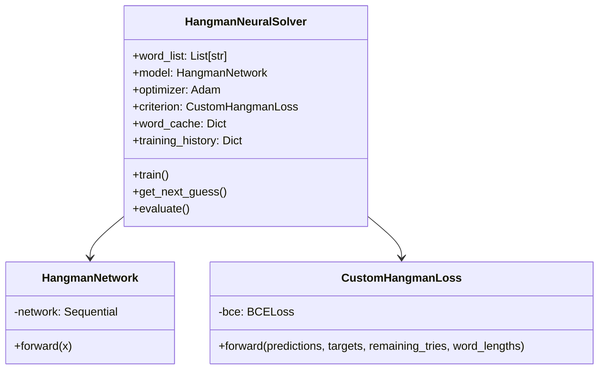
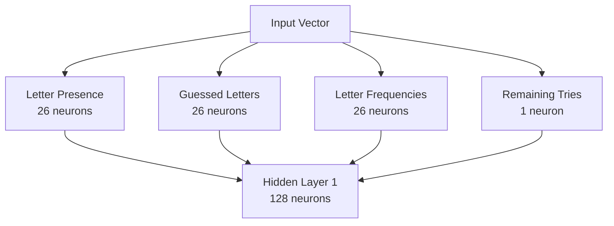
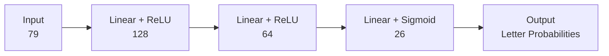
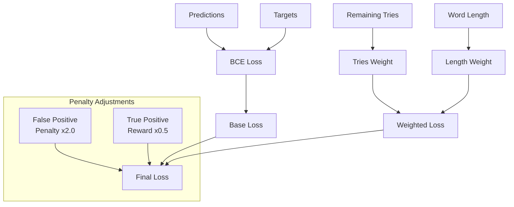
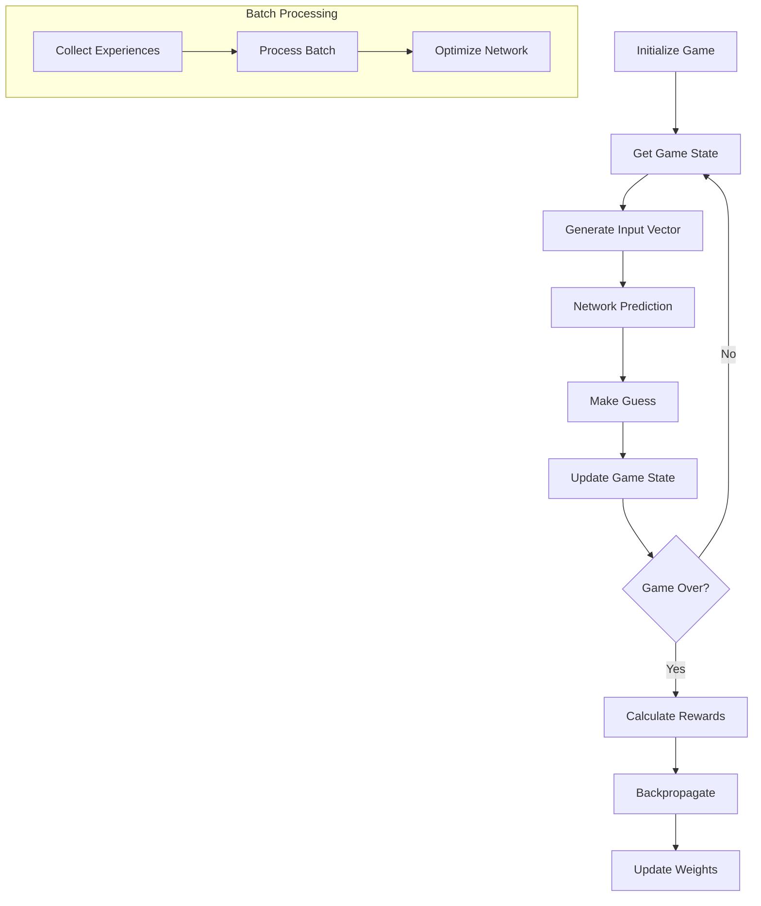
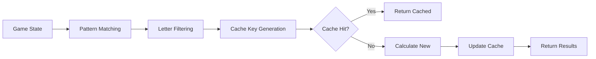
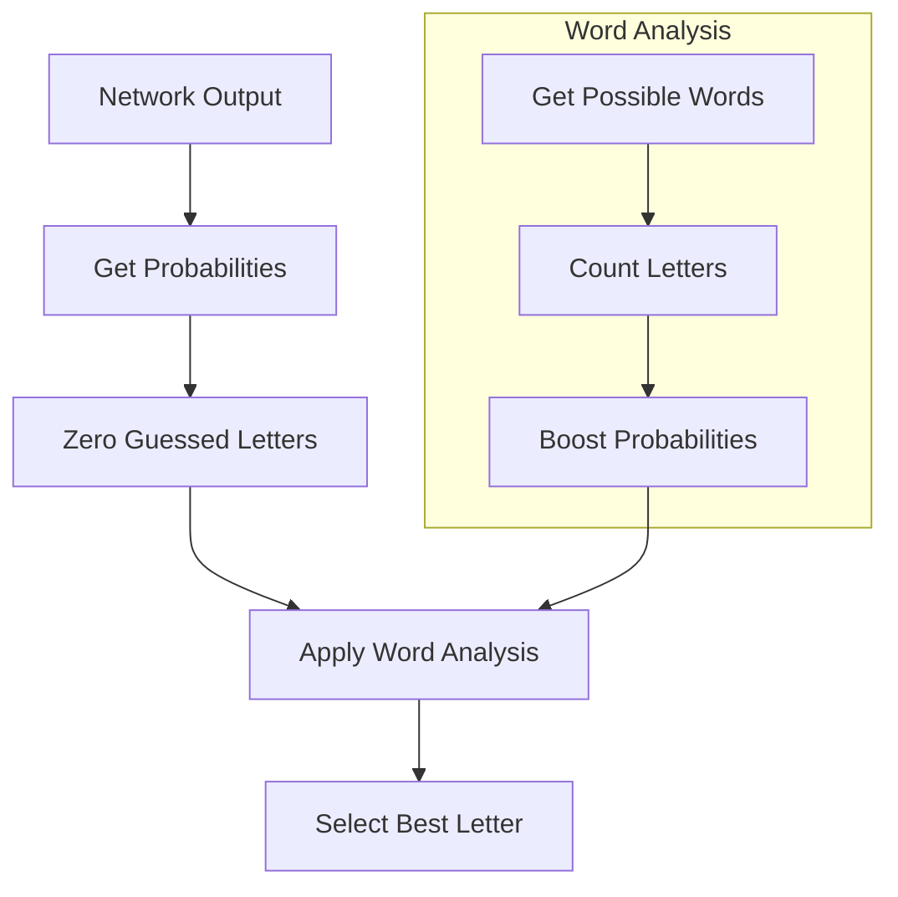

# Neural Network Hangman Solver

## Overview
The Neural Network Hangman Solver implements a deep learning approach to playing Hangman using PyTorch. The system combines traditional game state tracking with a neural network that learns optimal letter selection strategies through experience and reinforcement.

## Architecture



## Neural Network Architecture

### Input Layer (79 neurons)


1. **Pattern Information** (26 neurons)
   - Binary encoding of revealed letters
   - 1.0 for revealed letters in pattern
   - 0.0 for unrevealed positions

2. **Guessed Letters** (26 neurons)
   - Binary encoding of all attempted letters
   - 1.0 for previously guessed letters
   - 0.0 for available letters

3. **Letter Frequencies** (26 neurons)
   - Normalized frequencies from possible words
   - Higher values for common letters
   - Derived from remaining word possibilities

4. **Game State** (1 neuron)
   - Normalized remaining tries (tries/6)
   - Provides urgency information to network

### Hidden Layers


1. **First Hidden Layer** (128 neurons)
   - Linear transformation with ReLU activation
   - Learns complex letter patterns
   - Maps game state to feature space

2. **Second Hidden Layer** (64 neurons)
   - Reduced dimensionality for focus
   - ReLU activation for non-linearity
   - Refines feature representations

3. **Output Layer** (26 neurons)
   - Sigmoid activation for probabilities
   - One neuron per possible letter
   - Values represent guess confidence

## Custom Loss Function



### Components
1. **Base Loss**
   - Binary Cross-Entropy (BCE)
   - Measures prediction accuracy
   - Formula: -Σ(y·log(p) + (1-y)·log(1-p))

2. **Dynamic Weighting**
   ```python
   tries_weight = 1.0 + (6.0 - remaining_tries) / 2.0
   length_weight = word_lengths / 6.0
   ```
   - Increases penalty for fewer tries
   - Scales with word complexity

3. **Strategic Penalties**
   - False Positive Penalty (2.0x)
   - True Positive Reward (0.5x)
   - Encourages conservative guessing

## Training Process



### Training Strategy
1. **Episode Collection**
   - Full games are played
   - States and actions stored
   - Outcomes determine rewards

2. **Batch Processing**
   - 32 moves per batch
   - Gradient clipping at 1.0
   - Adam optimizer (lr=0.001)

3. **Reward Structure**
   ```python
   reward_scale = 2.0 if game_won else 0.5
   ```
   - Winning games heavily rewarded
   - Losing games penalized

## Word Possibility Tracking



### Caching System
1. **Cache Key**
   - Pattern string
   - Sorted guessed letters
   - Ensures consistent lookup

2. **Pattern Matching**
   - Regex-based filtering
   - Length verification
   - Letter consistency check

3. **Performance Impact**
   - Reduces computation
   - Speeds up training
   - Memory-efficient storage

## Guess Selection Logic



### Selection Process
1. **Network Probabilities**
   - Raw sigmoid outputs
   - 26 letter confidences
   - Range: [0.0, 1.0]

2. **Probability Adjustment**
   ```python
   probabilities[idx] *= (1 + count / len(possible_words))
   ```
   - Based on word possibilities
   - Frequency boosting
   - Position awareness

3. **Final Selection**
   - Highest adjusted probability
   - Filtered for validity
   - Strategic weighting

## Performance Metrics

### Evaluation
- Win rate tracking
- Average tries per game
- Training loss history
- Strategy effectiveness

### Model Persistence
- State dict saving
- Optimizer state backup
- Training history storage
- Easy model reloading

## Usage

```bash
# Train new model
python hangman_nn.py --train --episodes 1000

# Evaluate existing model
python hangman_nn.py --eval-games 100

# Custom model path
python hangman_nn.py --model-path "custom_model.pth"
```

## Implementation Details
- PyTorch framework
- CUDA/CPU compatibility
- Efficient state representation
- Sophisticated loss function
- Strategic reward shaping
``` 