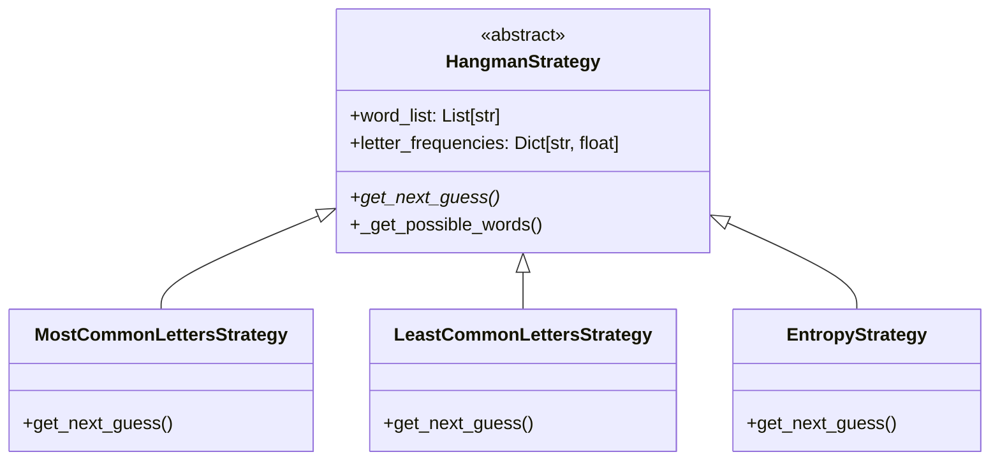
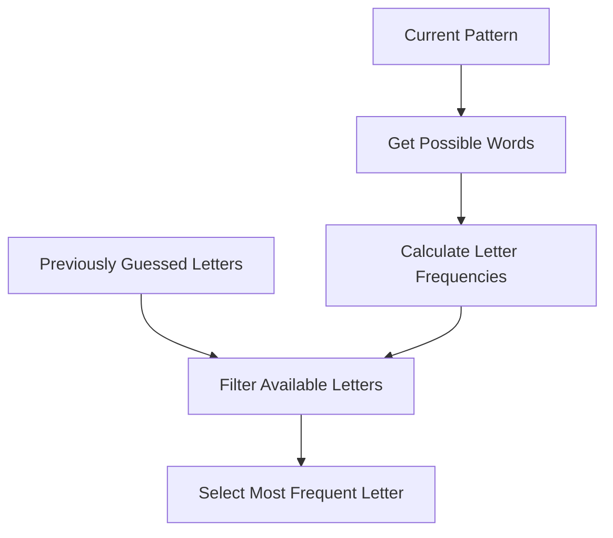
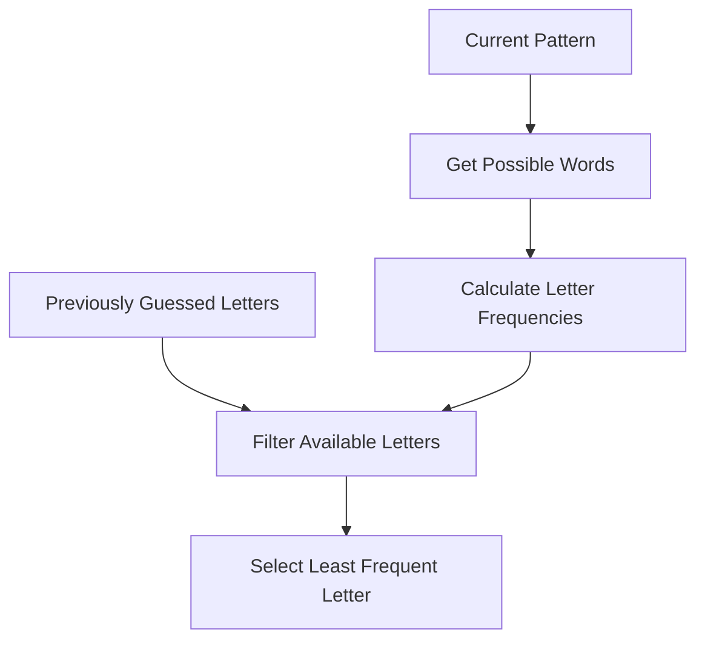
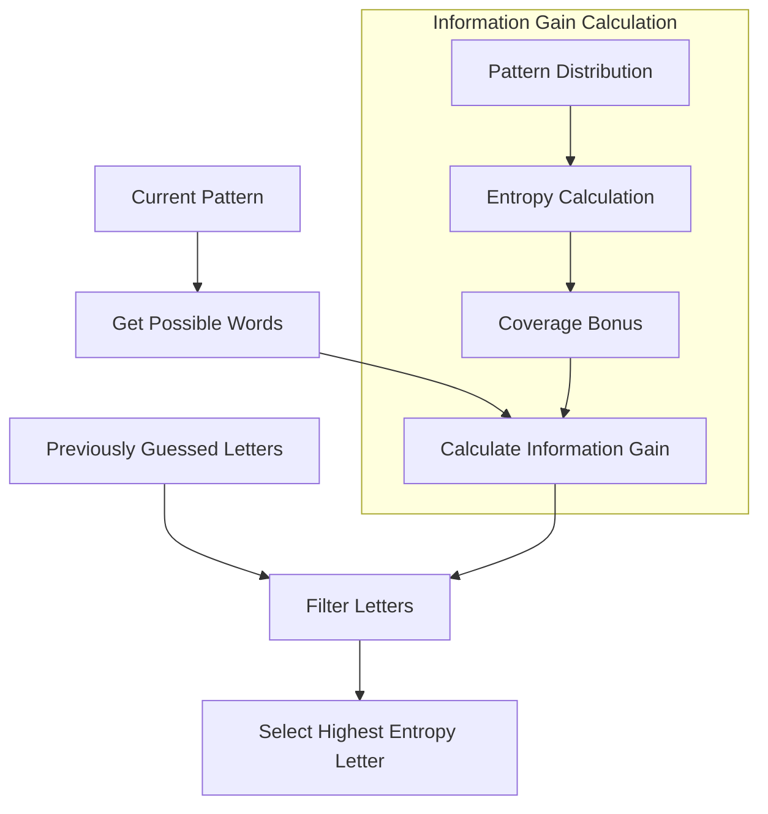
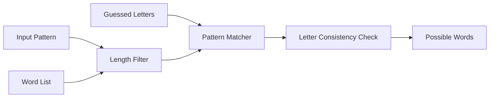
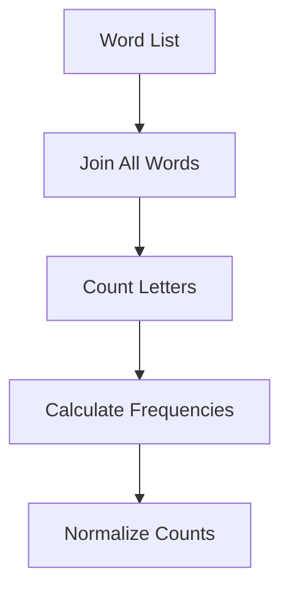
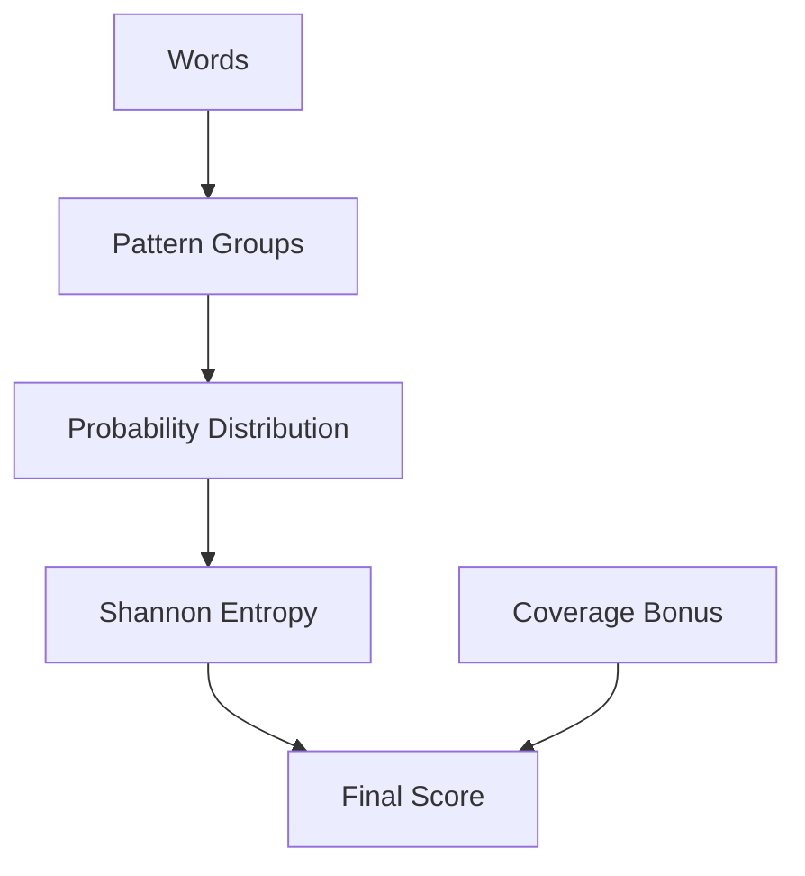

# Simple Strategies Hangman Solver

## Overview
The Simple Strategies Hangman Solver implements three different algorithmic approaches to playing Hangman, each using statistical and information theory concepts without neural networks. The strategies are based on letter frequency analysis and information gain calculations.

## Architecture



## Strategies

### 1. Most Common Letters Strategy



- Uses letter frequency analysis from remaining possible words
- Falls back to original word list frequencies if no possible words found
- Selects the most frequently occurring unguessed letter

### 2. Least Common Letters Strategy



- Inverse of the Most Common Letters Strategy
- Useful for words containing rare letters
- Helps eliminate unlikely letters quickly

### 3. Entropy Strategy



- Based on information theory principles
- Calculates information gain (entropy) for each possible guess
- Considers both letter presence and positions
- Includes coverage bonus for common letters

## Core Components

### 1. Word Filtering System



- Filters words based on:
  - Length matching
  - Pattern compatibility
  - Guessed letter consistency
- Maintains game state integrity

### 2. Letter Frequency Analysis



- Calculates letter frequencies from word list
- Normalizes frequencies for fair comparison
- Used by both Common Letters strategies

### 3. Entropy Calculation



- Implements Shannon entropy calculation
- Groups words by resulting patterns
- Adds coverage bonus for practical effectiveness
- Formula: Entropy = -Σ(p * log2(p)) + 0.1 * coverage

## Usage

```bash
python hangman_ss.py mc  # Use Most Common Letters Strategy
python hangman_ss.py lc  # Use Least Common Letters Strategy
python hangman_ss.py e   # Use Entropy Strategy
```

Additional options:
- `--games N`: Number of games to play
- `--no-example`: Skip example game display

## Performance Analysis

Each strategy's performance is tracked and saved:
- Win/loss ratio
- Word length correlation
- Success rate by word
- Results saved to strategy-specific CSV files

## Strategy Selection Guide

1. **Most Common Letters Strategy**
   - Best for: Common words with typical letter distributions
   - Advantages: Simple, fast, generally effective
   - Disadvantages: Struggles with unusual words

2. **Least Common Letters Strategy**
   - Best for: Words with rare letters
   - Advantages: Can find unusual patterns quickly
   - Disadvantages: Less effective for common words

3. **Entropy Strategy**
   - Best for: General purpose use
   - Advantages: Balanced approach, considers position information
   - Disadvantages: More computationally intensive

## Implementation Details

- Pure Python implementation
- No external dependencies except NumPy
- Efficient caching of word possibilities
- Strategy-specific result tracking
- Command-line interface for easy testing 